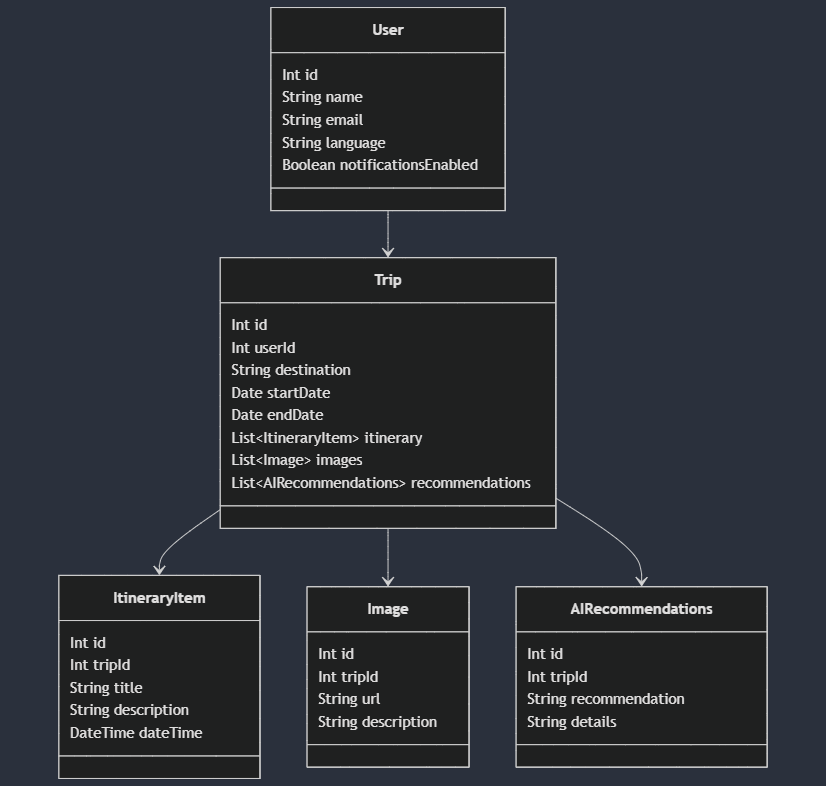

## Data Model

### MVVM Architecture

The MVVM (Model-View-ViewModel) architecture is used to separate the development of the graphical user interface from the business logic or back-end logic. This helps in organizing the code and making it more maintainable.

### Components

#### Model
The Model represents the data and business logic of the application. It is responsible for managing the data, whether it is from a local database or a remote server.

**Entities:**
- **User**
  - `id`: `Int` - Unique identifier for the user.
  - `name`: `String` - Name of the user.
  - `email`: `String` - Email address of the user.
  - `language`: `String` - Preferred language of the user.
  - `notificationsEnabled`: `Boolean` - Whether notifications are enabled for the user.

- **Trip**
  - `id`: `Int` - Unique identifier for the trip.
  - `userId`: `Int` - Identifier of the user who created the trip.
  - `destination`: `String` - Destination of the trip.
  - `startDate`: `Date` - Start date of the trip.
  - `endDate`: `Date` - End date of the trip.
  - `itinerary`: `List<ItineraryItem>` - List of itinerary items for the trip.
  - `images`: `List<Image>` - List of images for the trip.
  - `recommendations`: `List<AIRecommendations>` - List of AI recommendations for the trip.

- **ItineraryItem**
  - `id`: `Int` - Unique identifier for the itinerary item.
  - `tripId`: `Int` - Identifier of the trip to which the item belongs.
  - `title`: `String` - Title of the itinerary item.
  - `description`: `String` - Description of the itinerary item.
  - `dateTime`: `DateTime` - Date and time of the itinerary item.

- **Image**
  - `id`: `Int` - Unique identifier for the image.
  - `tripId`: `Int` - Identifier of the trip to which the image belongs.
  - `url`: `String` - URL of the image.
  - `description`: `String` - Description of the image.

- **AIRecommendations**
  - `id`: `Int` - Unique identifier for the AI recommendation.
  - `tripId`: `Int` - Identifier of the trip to which the recommendation belongs.
  - `recommendation`: `String` - Recommendation text.
  - `details`: `String` - Details of the recommendation.

#### View



#### ViewModel
The ViewModel acts as a bridge between the Model and the View. It holds the data required by the View and handles the logic to update the Model based on user interactions.

**Responsibilities:**
- Fetching data from the Model and exposing it to the View.
- Handling user actions and updating the Model accordingly.
- Managing the state of the UI components.

### Relationships
- A `User` can have multiple `Trip`s.
- A `Trip` can have multiple `ItineraryItem`s.
- A `Trip` can have multiple `Image`s.
- A `Trip` can have multiple `AIRecommendations`.


```mermaid
classDiagram
User --> Trip
Trip --> ItineraryItem
Trip --> Image
Trip --> AIRecommendations

class User {
    Int id
    String name
    String email
    String language
    Boolean notificationsEnabled
}

class Trip {
    Int id
    Int userId
    String destination
    Date startDate
    Date endDate
    List~ItineraryItem~ itinerary
    List~Image~ images
    List~AIRecommendations~ recommendations
}

class ItineraryItem {
    Int id
    Int tripId
    String title
    String description
    DateTime dateTime
}

class Image {
    Int id
    Int tripId
    String url
    String description
}

class AIRecommendations {
    Int id
    Int tripId
    String recommendation
    String details
}