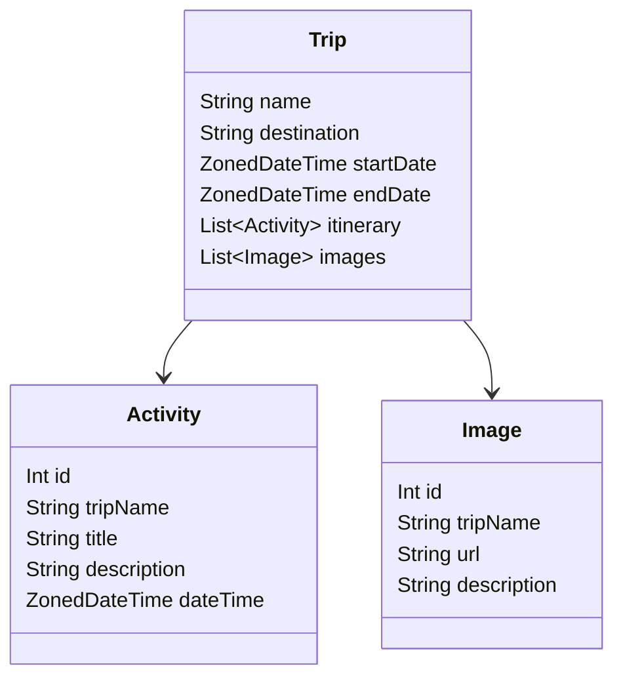
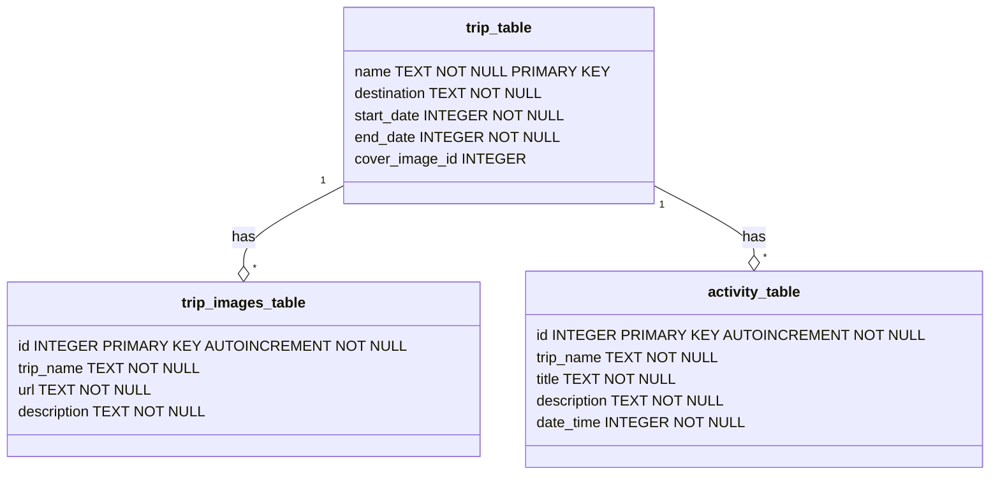

## Data Model

### MVVM Architecture

The MVVM (Model-View-ViewModel) architecture is used to separate the development of the graphical user interface from the business logic (The domain layer). 
This helps in organizing the code and making it more maintainable and reusable.

### Components

#### Model
The Model represents the data and business logic of the application. It is responsible for managing the data, whether it is from a local database or a remote server.

**Entities:**
- **Trip**
  - `name`: `String` - Unique identifier for the trip.
  - `destination`: `String` - Destination of the trip.
  - `startDate`: `ZonedDateTime` - Start date of the trip.
  - `endDate`: `ZonedDateTime` - End date of the trip.
  - `itinerary`: `List<Activity>` - List of activities that form a Itinerary for the trip.
  - `images`: `List<Image>` - List of images for the trip.

- **Activity**
  - `id`: `Int` - Unique identifier for the activity.
  - `tripId`: `Int` - Identifier of the trip to which the item belongs.
  - `title`: `String` - Title of the activity.
  - `description`: `String` - Description of the activity.
  - `dateTime`: `ZonedDateTime` - Date and time when the activity starts.

- **Image**
  - `tripId`: `Int` - Identifier of the trip to which the image belongs.
  - `url`: `String` - URL of the image.
  - `description`: `String` - Description of the image.

##### Mermaid visualization of the Model

#### View
The View is responsible for displaying the data to the user and handling user interactions.
It is the UI of the application (all the composable functions).

#### ViewModel
The ViewModel acts as a bridge between the Model and the View. It holds the data required by the View and handles the logic to update the Model based on user interactions.

**Responsibilities:**
- Fetching data from the Model and exposing it to the View.
- Handling user actions and updating the Model accordingly.
- Managing the state of the UI components.

### Relationships
- A `User` can have multiple `Trip`s.
- A `Trip` can have multiple `Activity`s.
- A `Trip` can have multiple `Image`s.

